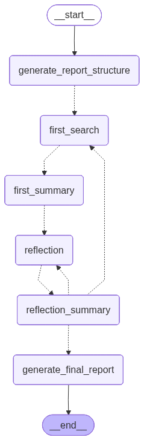
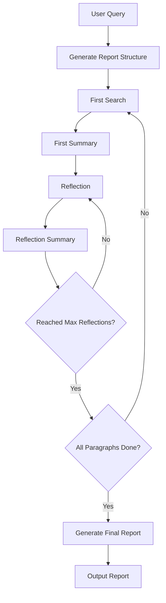

# DeepSearch Demo

[](https://python.org)
[](LICENSE)
[](https://langchain-ai.github.io/langgraph/)
[](https://platform.deepseek.com/)
[](https://tavily.com/)

A deep research AI agent implementation based on **LangGraph** framework, capable of generating high-quality research reports through multi-round searching and reflection.

This project is inspired by [DeepSearchAgent-Demo](https://github.com/666ghj/DeepSearchAgent-Demo) and refactored using LangGraph.



## Features

- **LangGraph Framework**: Built with LangGraph state machine workflow for clean code structure
- **Multi-LLM Support**: Based on LangChain, supporting DeepSeek, OpenAI and other major LLMs
- **Smart Search**: Integrated Tavily search engine for high-quality web searches
- **Reflection Mechanism**: Multi-round reflection optimization to ensure research depth and completeness
- **State Management**: Complete research process state tracking and persistence
- **Command Line Tool**: User-friendly CLI interface based on Typer
- **Markdown Output**: Beautiful Markdown formatted research reports
- **Visual Workflow**: Supports generating Mermaid flow diagrams

## How It Works

DeepSearch Demo uses a phased research approach implemented with LangGraph state machine:



### Core Workflow

1. **Structure Generation**: Generate report outline and paragraph structure based on the query
2. **Initial Research**: Generate search queries for each paragraph and gather relevant information
3. **Initial Summary**: Generate paragraph drafts based on search results
4. **Reflection Optimization**: Multi-round reflection to identify gaps and conduct supplementary searches
5. **Final Integration**: Combine all paragraphs into a complete Markdown report

### LangGraph Nodes

- `generate_report_structure`: Generate the report structure
- `first_search`: Perform initial search for current paragraph
- `first_summary`: Generate initial summary based on search results
- `reflection`: Reflect on current content and conduct supplementary searches
- `reflection_summary`: Update summary and decide whether to continue reflection
- `generate_final_report`: Integrate all paragraphs into final report

## Installation

### Requirements

- Python 3.12+

### Install with uv

```bash
# Navigate to project directory
cd projects/deepsearch-demo

# Install dependencies
uv sync
```

### Configure API Keys

Set environment variables:

```bash
# DeepSeek API Key (required)
export DEEPSEEK_API_KEY="your_deepseek_api_key_here"

# Tavily Search API Key (required)
export TAVILY_API_KEY="your_tavily_api_key_here"
```

## Usage

### Basic Usage

Run a research query:

```bash
uv run deepsearch-demo research "Artificial intelligence development trends in 2025"
```

Output will be saved to `output/<timestamp>/` directory, containing:
- `report.md` - Final research report
- `state.json` - Complete state data
- `running.log` - Runtime logs
- `messages.md` - Detailed message records

### Custom Parameters

```bash
# Specify output directory
uv run deepsearch-demo research "Quantum computing" --save-dir ./my-report

# Set maximum reflection iterations
uv run deepsearch-demo research "Blockchain technology" --max-reflections 5
```

### Visualize Workflow

Generate LangGraph flow diagram:

```bash
uv run deepsearch-demo plot-graph
# Or specify output path
uv run deepsearch-demo plot-graph ./graph.png
```

### Programmatic Usage

```python
from pathlib import Path
from deepsearch_demo.agents import DeepSearchAgent

# Create Agent
agent = DeepSearchAgent(
    save_dir=Path('./output'),
    max_reflections=3
)

# Execute research
agent.research("Ethical issues in artificial intelligence")
```

## Project Structure

```
deepsearch-demo/
├── src/deepsearch_demo/
│   ├── __init__.py
│   ├── agents.py          # Core Agent and LangGraph definitions
│   ├── state.py           # State data structures
│   ├── schema.py          # Pydantic models
│   ├── tools.py           # Tavily search tool
│   ├── utils.py           # Utility functions
│   └── cli.py             # Command line interface
├── pyproject.toml
└── README.md
```

## Comparison with Original Project

| Feature | Original Project | This Project |
|---------|-----------------|--------------|
| Framework | Framework-free (from scratch) | LangGraph |
| State Management | Custom state classes | LangGraph State + dataclass |
| Workflow Control | Manual loops | StateGraph node transitions |
| LLM Calls | Custom wrappers | LangChain `init_chat_model` |
| CLI | Example scripts | Full Typer CLI |
| Visualization | None | Mermaid graph generation |

## Getting API Keys

- **DeepSeek**: Visit [DeepSeek Platform](https://platform.deepseek.com/) to register and get your key
- **Tavily**: Visit [Tavily](https://tavily.com/) to register (1000 free searches per month)

## Acknowledgments

- Thanks to [DeepSearchAgent-Demo](https://github.com/666ghj/DeepSearchAgent-Demo) for the original implementation
- Thanks to [DeepSeek](https://www.deepseek.com/) for providing excellent LLM services
- Thanks to [Tavily](https://tavily.com/) for providing high-quality search API
- Thanks to [LangGraph](https://langchain-ai.github.io/langgraph/) for the workflow framework
